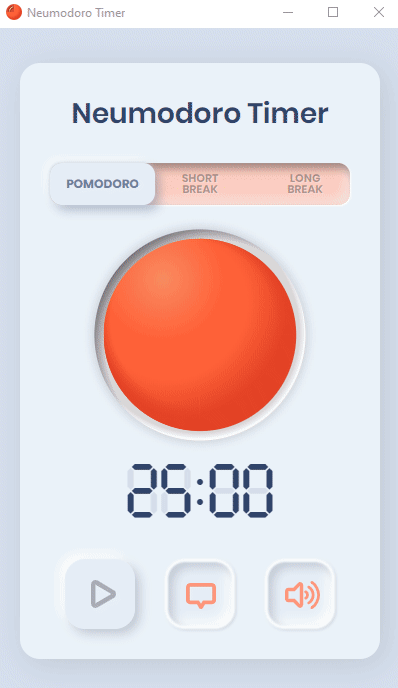

# Neumodoro Timer
### The Pomodoro timer with a neumorphic look.

You can find it hosted on the [app website](https://www.neumodoro.com/)

### Description
This was a practice side project for me to try out making an Electron app with the intent to deliver it to Mac, Windows, and Linux. I also wanted an excuse to try out some neumorphic UI creation as it was trending. It includes:

* Manual mode switching, or automatic when the current pomodoro or break is complete.
* Separate sound effects for the end of a pomodoro and the end of a break, which can be disabled with the sound toggle button.
* A custom built clock font for properly aligned overlay to simulate the look of a digital clock.
* Native operating system notifications for timer completion.
* Animated tomoto slices and seeds as the state changes.
* Custom icons (I know they are nothing special but I made them so they are cool)
* Inline SVG tomoto made in layers and animated with state derived classes and Framer Motion
* Downloadable .dmg for MacOS, .exe for Windows, and .deb for Ubuntu (Catalina made it much more difficult to install .dmg files with a paid for developer license, and I haven't gotten around to fixing that, sorry)

